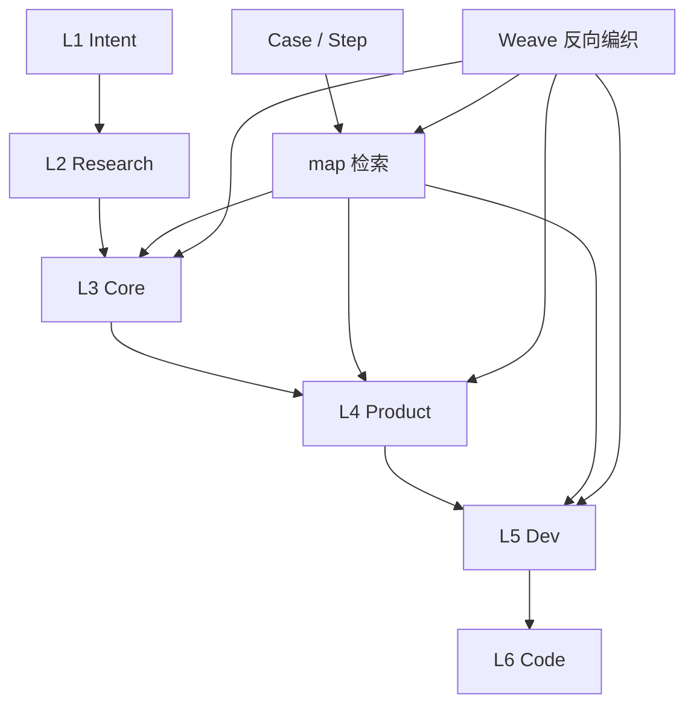

# L3 核心概念地图

本文件是 AIPD2 核心概念的检索入口。它只索引稳定概念、别名、关系和细节文档，不替代 L3 正文。

## 核心概念总表

| 用户说法 / 黑话 | 标准概念 | 含义 | 细节文档 | 相关 L4 功能线 | 常见误解 |
|---|---|---|---|---|---|
| ADOC / 项目认知 | ADOC / `_adoc` | 面向 AI 协作的长期项目认知结构 | `_adoc/L3-core/vertical-concept-modules.md`、`aipd-skill/src/core/adoc-structure.md` | AIPD 初始化、AIPD Update、Weave | 不等同于普通 README |
| L1-L6 / 纵向模块 | 纵向概念模块 | 项目认知和代码实现按层级沉淀的结构 | `_adoc/L3-core/vertical-concept-modules.md` | AIPD 初始化、case-create、case-run | 不是产品功能清单 |
| map / case / weave | 横向功能能力 | Agent 做事时串联纵向模块的能力 | `_adoc/L3-core/horizontal-capabilities.md` | AIPD Update、Case Create、Case Run、Weave、Learn | 不是新的认知层级 |
| 外部世界 / 痛点 / 竞品 | L2 Research | 项目方向所处的外部世界 | `_adoc/L3-core/vertical-concept-modules.md`、`aipd-skill/src/core/L2-scenario/guide.md` | AIPD 初始化、case-create | L2 不只是痛点 |
| 成立模型 / 核心对象 / 数据模型 | L3 Core | 项目内部长期成立所依赖的稳定模型 | `_adoc/L3-core/index.md`、`aipd-skill/src/core/L3-engine/guide.md` | AIPD 初始化、AIPD Update | 不等于狭义数据库模型 |
| 上下文解耦 | 任务上下文解耦 | 把任务设计成小而自足的上下文黑箱 | `_adoc/L3-core/index.md`、`aipd-skill/src/core/overview.md` | case-create、case-run | 不是否定知识库和上下文检索 |
| 黑箱上移 | 决策杠杆上移 | 把人的决策位置从局部实现细节上移到边界、输入输出和验收层 | `_adoc/L3-core/index.md` | case-create、case-run | 不等同于传统封装 |
| 扁平化检索 | 大地图 + 细节 Map | 用结构化总图提高 AI 第一跳命中率 | `_adoc/L3-core/index.md`、`_adoc/map.md` | AIPD Update、case-create、weave | 不是取消分层维护 |
| 分身 Agent | fork 出来的 Main Agent 克隆体 | 进入局部探索分支并回流结论的同源 Agent | `_adoc/L5-dev/index.md`、`aipd-skill/src/platforms/codex/core/agent-guide.md` | case-run、Agent 调度 | 不是低上下文执行工人 |
| Weave 反向编织 | 项目知识回写 | 把稳定信息回写到当前项目 ADOC、局部 README、map 或 case | `_adoc/L3-core/horizontal-capabilities.md`、`aipd-skill/src/skills/aipd2-weave/SKILL.md` | Weave | 和 `aipd2-learn` 分工不同 |

## 对象关系

## 兜底搜索

- `rg "上下文解耦|黑箱上移|扁平化检索|Weave|分身 Agent|L3 Core" _adoc src`
- `rg "纵向概念|横向功能|L1-L6|Case|Step|Agent Entry" _adoc src`
