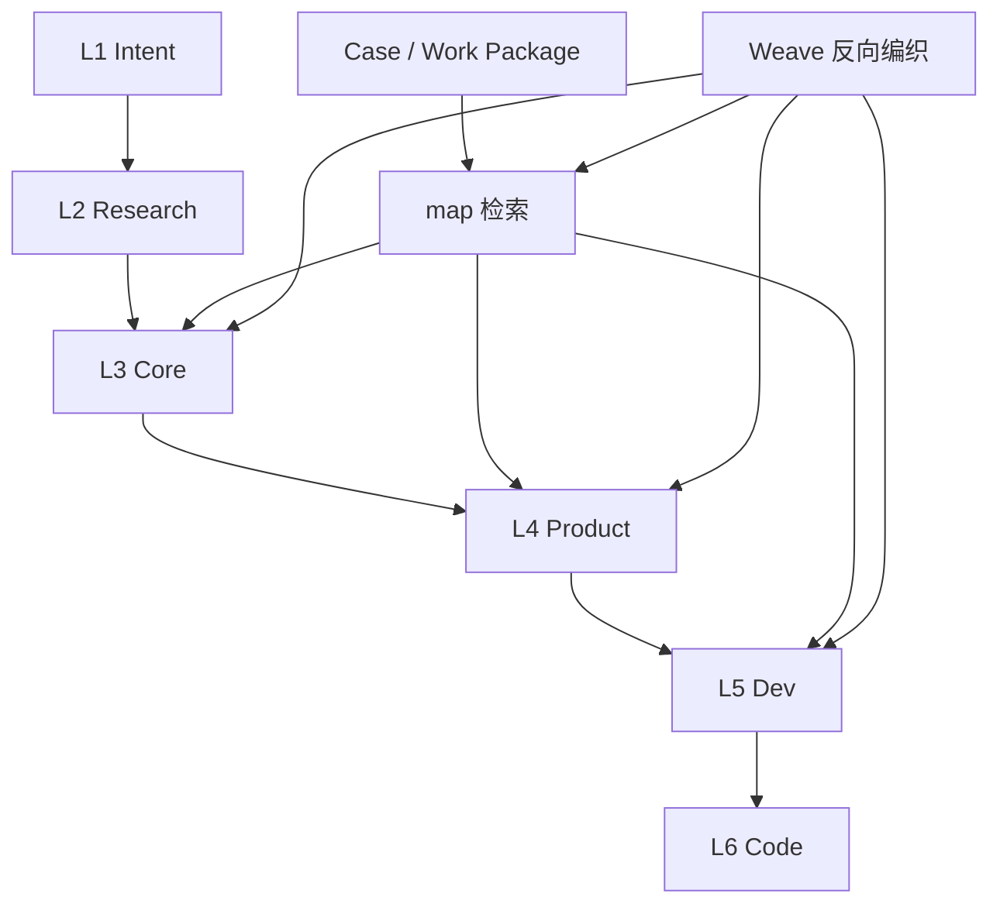

# L3 核心概念地图

本文件是 AIPD 核心概念的检索入口。它只索引稳定概念、别名、关系和细节文档，不替代 L3 正文。

## 核心成立模型总表

| 用户说法 / 黑话 | 标准模型 | 含义 | 细节文档 | 相关 L4 功能线 | 常见误解 |
|---|---|---|---|---|---|
| 知识库 / ADOC / Weave / 知识回写 | 项目知识库维护模型 | AIPD 如何分层存储、更新、回写并维护项目知识库可信度 | `_adoc/L3-core/index.md`、`_adoc/L3-core/vertical-concept-modules.md`、`_adoc/L3-core/horizontal-capabilities.md` | AIPD 初始化、AIPD Update、Weave | Weave 不是独立于知识库的模型，而是知识库更新机制 |
| map / 大地图 / 上下文检索 / 找上下文 | Map-first 上下文检索模型 | Agent 先读显性 map，再进入 L3/L4/L5/局部 README/L6，搜索只作为兜底并反向回写稳定入口 | `_adoc/L3-core/index.md`、`_adoc/map.md` | AIPD Update、AIPD Case、Weave | 不等同于默认 RAG、全文搜索或多层目录跳转 |
| Think / AIPD Think / 任务澄清 / 前置讨论 / 要不要做 | Think / 任务澄清决策模型 | 模糊想法或 case 推进中的未知如何通过讨论、调研、方案比较和决策出口变成清晰方向、设计输入或被 kill / defer / research / weave | `_adoc/L3-core/index.md`、`_adoc/L3-core/horizontal-capabilities.md` | AIPD Case、Weave | Think 可以在 Case 前，也可以作为 Case 内 phase |
| 长任务 / case / work package / 恢复 / 验收 | 任务执行模型 | 短周期目标如何通过 Case Contract / Think / Design / Execute / Verify / Close 变成可恢复、可验收、可关闭的执行闭环 | `_adoc/L3-core/index.md`、`_adoc/L3-core/horizontal-capabilities.md`、`_adoc/case/index.md` | AIPD Case | Case 不是普通聊天记录，Work Package 不是微步骤 |
| Main Agent / 分身 Agent / 角色 Agent / fork_context | Agent 协作思考模型 | 多个 Agent 如何分工探索、保护主线判断，并回流压缩结论 | `_adoc/L3-core/index.md`、`_adoc/L5-dev/index.md`、`aipd-skill/src/platforms/codex/core/agent-guide.md` | Case Execute、Agent 调度 | 分身 Agent 不是低上下文执行工人 |
| SOP / AI 程序 / Agent 程序 / 可复用流程 | SOP / AI 程序模型 | 可重复 Agent 行为如何沉淀成以 LLM / Agent 为运行时的 AI 原生程序 | `_adoc/L3-core/index.md`、`_adoc/sop/index.md`、`_adoc/sop/map.md` | SOP、AIPD Case、Weave | SOP 不是普通 L4/L5 知识条目，也不是单纯脚本 |
| AI 原生代码 / 上下文解耦 / 纵向黑箱 / 黑箱上移 / 模型底层倾向 / 提示词改不了 / 案例和边界 | AI 原生代码架构模型 | 真实代码如何更适合 AI 读取、修改、扩展和验收；承认模型底层倾向难以靠上下文临时改写，因此用案例、边界和验收口径约束行为 | `_adoc/L3-core/index.md`、`docs/modules/context-decoupling.md` | Vue 角色 Agent、技术栈经验库、L5 工程规则 | 不是反抽象，也不是只靠提示词讲道理；核心是 Decouple first, DRY later，并用案例和边界校准 Agent |

## 核心概念总表

| 用户说法 / 黑话 | 标准概念 | 含义 | 细节文档 | 相关 L4 功能线 | 常见误解 |
|---|---|---|---|---|---|
| ADOC / 项目认知 | ADOC / `_adoc` | 面向 AI 协作的长期项目认知结构 | `_adoc/L3-core/vertical-concept-modules.md`、`aipd-skill/src/core/adoc-structure.md` | AIPD 初始化、AIPD Update、Weave | 不等同于普通 README |
| L1-L6 / 纵向模块 | 纵向概念模块 | 项目认知和代码实现按层级沉淀的结构 | `_adoc/L3-core/vertical-concept-modules.md` | AIPD 初始化、aipd-case | 不是产品功能清单 |
| map / case / weave | 横向功能能力 | Agent 做事时串联纵向模块的能力 | `_adoc/L3-core/horizontal-capabilities.md` | AIPD Update、AIPD Case、Weave、Learn | 不是新的认知层级，也不是 L3 核心模型的替代分类 |
| 讨论层 / 定任务 / 从模糊到清晰 / 高带宽思考缓冲层 | Think | Case 前或 Case 内的思考 phase，用文件化状态承载讨论、调研、方案比较和决策出口 | `_adoc/L3-core/index.md`、`_adoc/L3-core/horizontal-capabilities.md` | AIPD Case | 不等同于 Inbox；Inbox 只暂存，Think 主动澄清并给出出口 |
| 外部世界 / 痛点 / 竞品 | L2 Research | 项目方向所处的外部世界 | `_adoc/L3-core/vertical-concept-modules.md`、`aipd-skill/src/core/L2-scenario/guide.md` | AIPD 初始化、aipd-case | L2 不只是痛点 |
| 成立模型 / 核心对象 / 数据模型 | L3 Core | 项目内部长期成立所依赖的稳定模型 | `_adoc/L3-core/index.md`、`aipd-skill/src/core/L3-engine/guide.md` | AIPD 初始化、AIPD Update | 不等于狭义数据库模型 |
| 上下文解耦 | 任务上下文解耦 | 把任务设计成小而自足的上下文黑箱，用实际案例、边界和验收口径约束 Agent | `_adoc/L3-core/index.md`、`docs/modules/context-decoupling.md`、`aipd-skill/src/core/overview.md` | aipd-case | 不是否定知识库和上下文检索，也不是期待模型靠一段上下文改变底层思维方式 |
| 黑箱上移 | 决策杠杆上移 | 把人的决策位置从局部实现细节上移到边界、输入输出和验收层 | `_adoc/L3-core/index.md` | aipd-case | 不等同于传统封装 |
| 扁平化检索 | Map-first 上下文检索 | 用结构化总图提高 AI 第一跳命中率 | `_adoc/L3-core/index.md`、`_adoc/map.md` | AIPD Update、aipd-case、weave | 不是取消分层维护，也不是默认 RAG |
| 分身 Agent | fork 出来的 Main Agent 克隆体 | 进入局部探索分支并回流结论的同源 Agent | `_adoc/L5-dev/index.md`、`aipd-skill/src/platforms/codex/core/agent-guide.md` | case Execute、Agent 调度 | 不是低上下文执行工人 |
| Weave 反向编织 | 项目知识库更新机制 | 把稳定信息回写到当前项目 ADOC、局部 README 或 map；一次性过程留在 case / work package | `_adoc/L3-core/horizontal-capabilities.md`、`aipd-skill/src/skills/aipd-weave/SKILL.md` | Weave | 它属于项目知识库维护模型；和 `aipd-learn` 分工不同 |

## 对象关系

## 兜底搜索

- `rg "上下文解耦|黑箱上移|扁平化检索|Weave|分身 Agent|L3 Core" _adoc src`
- `rg "纵向概念|横向功能|L1-L6|Case|Work Package|Agent Entry" _adoc src`
