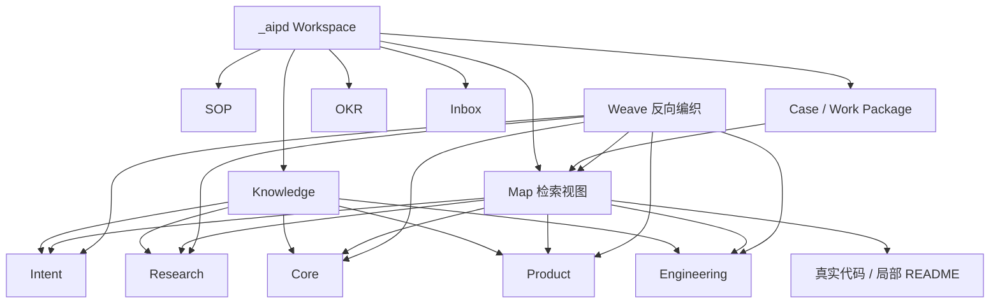

# Core 核心概念地图

本文件是 AIPD 核心概念的检索入口。它只索引稳定概念、别名、关系和细节文档，不替代 Core 正文。

## 核心成立模型总表

| 用户说法 / 黑话 | 标准模型 | 含义 | 细节文档 | 相关 Product 功能线 | 常见误解 |
|---|---|---|---|---|---|
| 知识库 / Knowledge / Weave / 知识回写 | 项目知识库维护模型 | AIPD 如何分类存储、更新、回写并维护项目知识库可信度 | `_aipd/knowledge/core/index.md`、`_aipd/knowledge/core/workspace-modules.md`、`_aipd/knowledge/core/horizontal-capabilities.md` | AIPD 初始化、AIPD Update、Weave | Weave 不是独立于知识库的模型，而是知识库更新机制 |
| map / 大地图 / 上下文检索 / 找上下文 | Map-first 上下文检索模型 | Agent 先读显性 map，再进入 Core/Product/Engineering/局部 README/真实代码，搜索只作为兜底并反向回写稳定入口 | `_aipd/knowledge/core/index.md`、`_aipd/map.md` | AIPD Update、AIPD Case、Weave | 不等同于默认 RAG、全文搜索或多层目录跳转 |
| 文件优先 / 落文件 / checkpoint / 聊天不是事实源 / 自然压缩 / 恢复入口 | 文件优先上下文承接模型 | 聊天只是运行缓存，文件才是长期事实源；影响恢复路径的小步确认、状态变化、调研边界和下一步游标要写成 checkpoint | `_aipd/knowledge/core/index.md`、`_aipd/knowledge/core/horizontal-capabilities.md`、`aipd-skill/src/core/case/overview.md` | AIPD Case、Agent Entry、Weave | 不是把聊天全文存档，也不是每句话都落文件；判断标准是恢复价值 |
| Think / AIPD Think / 任务澄清 / 前置讨论 / 要不要做 | Think / 任务澄清决策模型 | 模糊想法或 case 推进中的未知如何通过讨论、调研、方案比较和决策出口变成清晰方向、设计输入或被 kill / defer / research / weave | `_aipd/knowledge/core/index.md`、`_aipd/knowledge/core/horizontal-capabilities.md` | AIPD Case、Weave | Think 可以在 Case 前，也可以作为 Case 内 phase |
| 长任务 / case / work package / 恢复 / 验收 | 任务执行模型 | 短周期目标如何通过 Case Contract / Think / Design / Execute / Verify / Close 变成可恢复、可验收、可关闭的执行闭环 | `_aipd/knowledge/core/index.md`、`_aipd/knowledge/core/horizontal-capabilities.md`、`_aipd/case/index.md` | AIPD Case | Case 不是普通聊天记录，Work Package 不是微步骤 |
| `$aipd-leader` / Mission / 项目负责人 / 多 Case task / cursor-agent | Leader 项目主导编排模型 | 用户如何显式委托一个 AI Leader 负责一个 active Mission 的方向探索、Case 执行层协调和总验收 | `_aipd/knowledge/core/index.md`、`_aipd/knowledge/core/horizontal-capabilities.md`、`aipd-skill/src/core/leader/guide.md` | AIPD Leader | 不因任务复杂、提到 Leader 或存在多个 Case 自动启动；Cursor 上执行层是 `cursor-agent`，不是 DSH 或对话内子 Agent |
| Main Agent / Child Agent / 分身 Agent / 角色 Agent / fork_context | Agent 协作思考模型 | 每个 task 如何按上下文隔离、真实并发、主线耦合和调度成本选择 Main 或 Child，并回流压缩结论 | `_aipd/knowledge/core/index.md`、`_aipd/knowledge/engineering/index.md`、`aipd-skill/src/platforms/codex/core/agent-guide.md` | Case Execute、Agent 调度 | Work Package 不是派发节点；Child 也不是低上下文执行工人 |
| SOP / AI 程序 / Agent 程序 / 可复用流程 | SOP / AI 程序模型 | 可重复 Agent 行为如何沉淀成以 LLM / Agent 为运行时的 AI 原生程序 | `_aipd/knowledge/core/index.md`、`_aipd/sop/index.md`、`_aipd/sop/map.md` | SOP、AIPD Case、Weave | SOP 不是普通 Product/Engineering 知识条目，也不是单纯脚本 |
| AI 原生代码 / 上下文解耦 / AI 友好代码拓扑 / 纵向黑箱 / 黑箱上移 / 模型底层倾向 / 提示词改不了 / 案例和边界 | AI 原生代码架构模型 | 真实代码如何更适合 AI 读取、修改、扩展和验收；承认模型底层倾向难以靠上下文临时改写，因此用案例、边界和验收口径约束行为 | `_aipd/knowledge/core/index.md`、`_aipd/knowledge/core/ai-friendly-code-topology.md`、`docs/modules/context-decoupling.md` | Vue 角色 Agent、技术栈经验库、Engineering 工程规则 | 不是反抽象、全面纵向或只靠提示词讲道理；核心是降低理解跳转与改动牵连，并用案例和边界校准 Agent |

## 核心概念总表

| 用户说法 / 黑话 | 标准概念 | 含义 | 细节文档 | 相关 Product 功能线 | 常见误解 |
|---|---|---|---|---|---|
| Knowledge / 项目认知 | 五类 Knowledge | 面向 AI 协作的长期、稳定项目认知 | `_aipd/knowledge/core/workspace-modules.md`、`aipd-skill/src/core/aipd-project-structure.md` | AIPD 初始化、AIPD Update、Weave | Knowledge 不等于整个 `_aipd/` Workspace，也不等于普通 README |
| AIPD Workspace / 工作区 | Workspace 模块 | 用 manifest / update-log 承接版本状态，把 Knowledge、Map、显式可选 Leader、SOP、Case、OKR 和 Inbox 放在统一可发现入口下；`AGENTS.md` 作为外部 Agent Entry | `_aipd/knowledge/core/workspace-modules.md` | AIPD 初始化、aipd-case、aipd-update、显式 Leader | 不是代码拓扑中的纵向业务上下文；Leader 不是第六类 Knowledge；真实代码不复制进 Workspace |
| map / case / weave | 横向功能能力 | Agent 做事时串联 Workspace 模块的能力 | `_aipd/knowledge/core/horizontal-capabilities.md` | AIPD Update、AIPD Case、Weave、Learn | 属于 AIPD 知识与流程系统，不是代码拓扑中的横向基座或共享能力 |
| 横向基座 / 横向共享能力 / 纵向业务上下文 / 纵向业务模块 / 全面纵向 / 显式组合 / 并列扩展 | AI 友好代码拓扑 | 横向基础与稳定共享能力支撑多个独立业务上下文，模块通过清楚契约组合 | `_aipd/knowledge/core/ai-friendly-code-topology.md` | AIPD Case Design、技术栈经验库、Engineering 工程规则 | 不是固定目录模板，不是全面纵向；“黑箱”描述边界质量，不是Workspace 模块专属属性 |
| 文件 checkpoint / 落盘 / 压缩后恢复 / 当前游标 | 文件优先上下文承接 | 用 case、phase、work package、README 和 map 承接长期上下文，让压缩或换 Agent 后能恢复当前状态 | `_aipd/knowledge/core/horizontal-capabilities.md`、`aipd-skill/src/core/case/overview.md` | AIPD Case、Agent Entry | 不等同于备忘；只写影响后续恢复路径的状态和判断 |
| 讨论层 / 定任务 / 从模糊到清晰 / 高带宽思考缓冲层 | Think | Case 前或 Case 内的思考 phase，用文件化状态承载讨论、调研、方案比较和决策出口 | `_aipd/knowledge/core/index.md`、`_aipd/knowledge/core/horizontal-capabilities.md` | AIPD Case | 不等同于 Inbox；Inbox 只暂存，Think 主动澄清并给出出口 |
| 外部世界 / 痛点 / 竞品 | Research | 项目方向所处的外部世界 | `_aipd/knowledge/core/workspace-modules.md`、`aipd-skill/src/core/knowledge/research/guide.md` | AIPD 初始化、aipd-case | Research 不只是痛点 |
| 成立模型 / 核心对象 / 数据模型 | Core | 项目内部长期成立所依赖的稳定模型 | `_aipd/knowledge/core/index.md`、`aipd-skill/src/core/knowledge/core/guide.md` | AIPD 初始化、AIPD Update | 不等于狭义数据库模型 |
| 上下文解耦 | 任务上下文解耦 | 把任务设计成小而自足的上下文黑箱，用实际案例、边界和验收口径约束 Agent | `_aipd/knowledge/core/index.md`、`_aipd/knowledge/core/ai-friendly-code-topology.md`、`docs/modules/context-decoupling.md`、`aipd-skill/src/core/overview.md` | aipd-case | 不是否定知识库和上下文检索，也不是期待模型靠一段上下文改变底层思维方式 |
| 黑箱上移 | 决策杠杆上移 | 把人的决策位置从局部实现细节上移到边界、输入输出和验收层 | `_aipd/knowledge/core/index.md` | aipd-case | 不等同于传统封装 |
| 扁平化检索 | Map-first 上下文检索 | 用结构化总图提高 AI 第一跳命中率 | `_aipd/knowledge/core/index.md`、`_aipd/map.md` | AIPD Update、aipd-case、weave | 不是取消分层维护，也不是默认 RAG |
| Child Agent / 分身 Agent / 角色 Agent | task 内用于隔离、并发或独立复核的局部执行者 | 在运行时净收益明确时接管唯一证据面，读取最小必要上下文并回流压缩结论 | `_aipd/knowledge/engineering/index.md`、`aipd-skill/src/platforms/codex/core/agent-guide.md` | case Execute、Agent 调度 | 不是每个 Work Package 的默认执行者；派发不扩大外部副作用权限 |
| Weave 反向编织 | 项目知识库更新机制 | 把稳定信息回写到当前项目 Knowledge、局部 README 或 map；一次性过程留在 case / work package | `_aipd/knowledge/core/horizontal-capabilities.md`、`aipd-skill/src/skills/aipd-weave/SKILL.md` | Weave | 它属于项目知识库维护模型；和仅在 AIPD 源码仓库运行的 `aipd-learn` 分工不同 |

## 对象关系

## 兜底搜索

- `rg "上下文解耦|黑箱上移|扁平化检索|Weave|Main / Child|分身 Agent|Core" _aipd src`
- `rg "Workspace|横向功能|Knowledge|Case|Work Package|Agent Entry" _aipd src`
