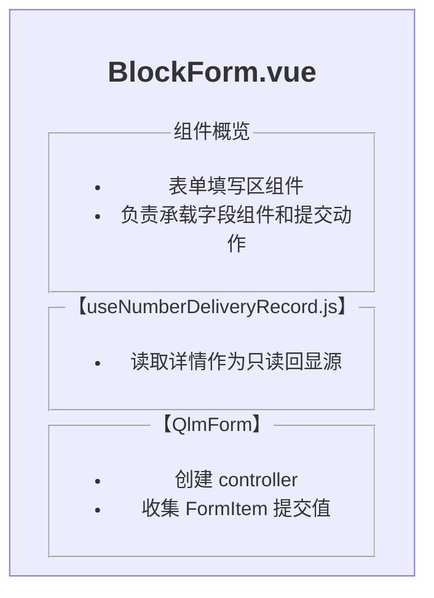
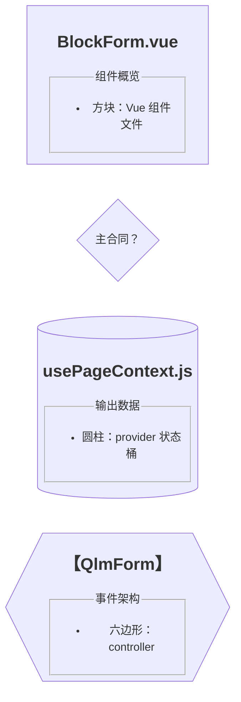
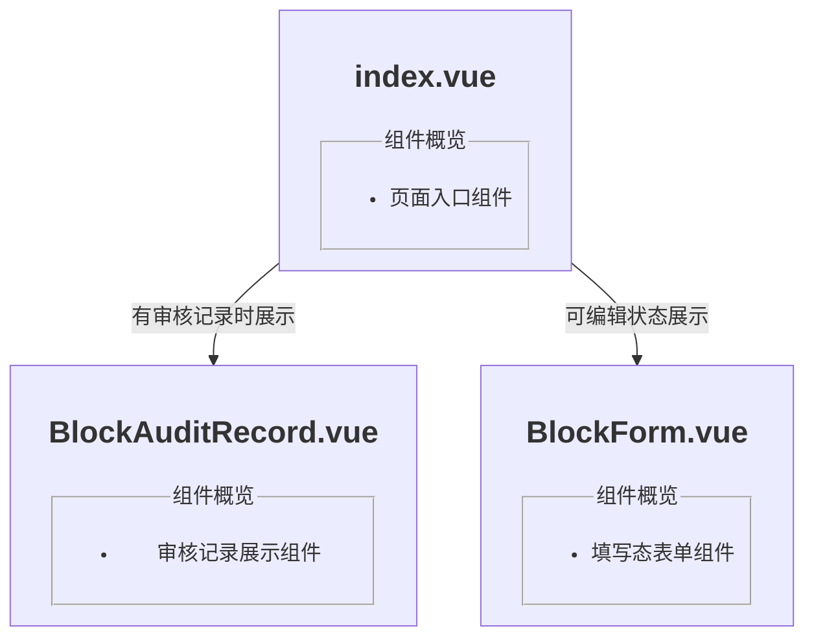
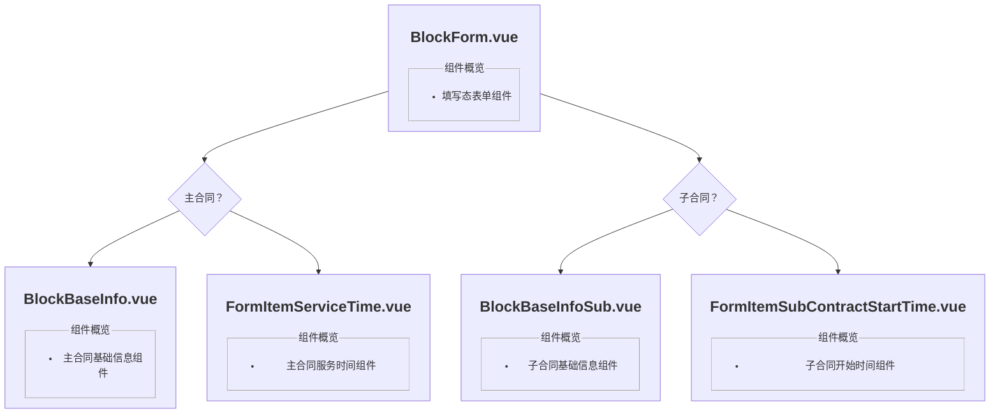
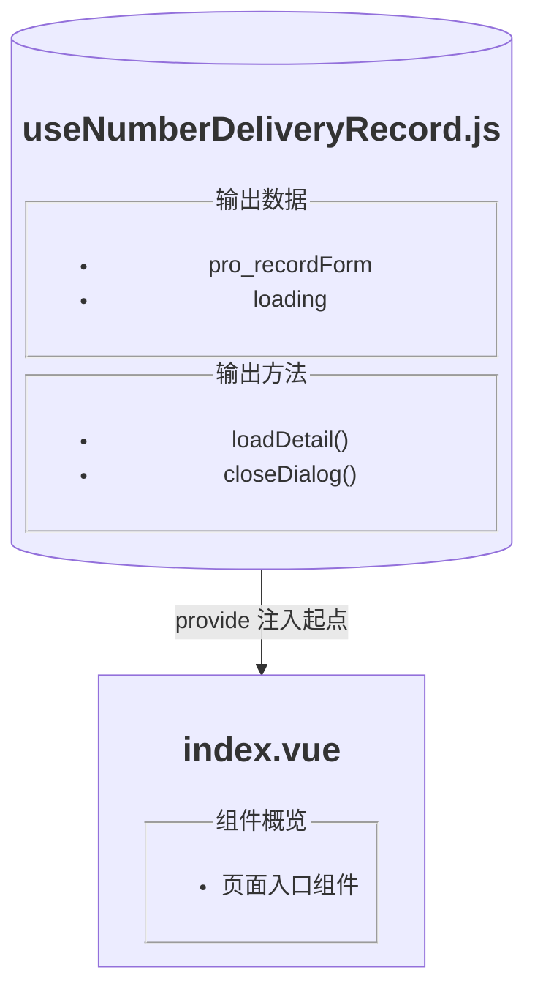
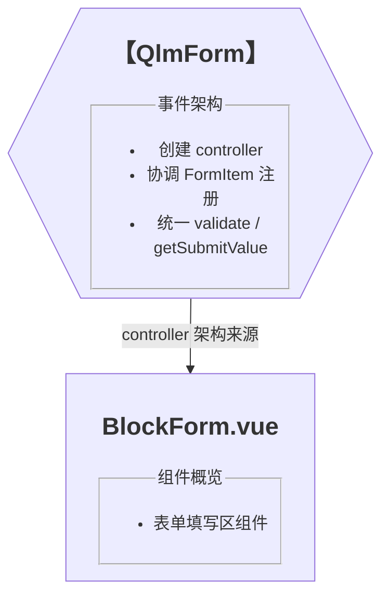
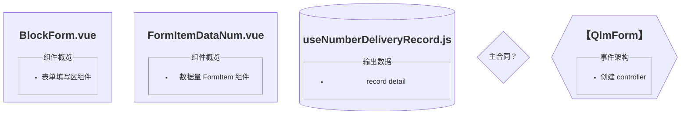
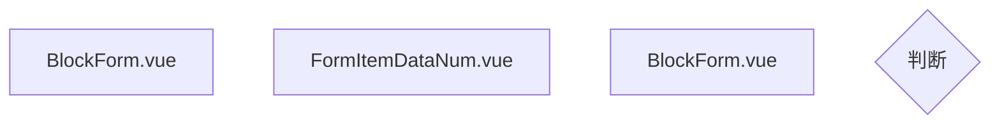
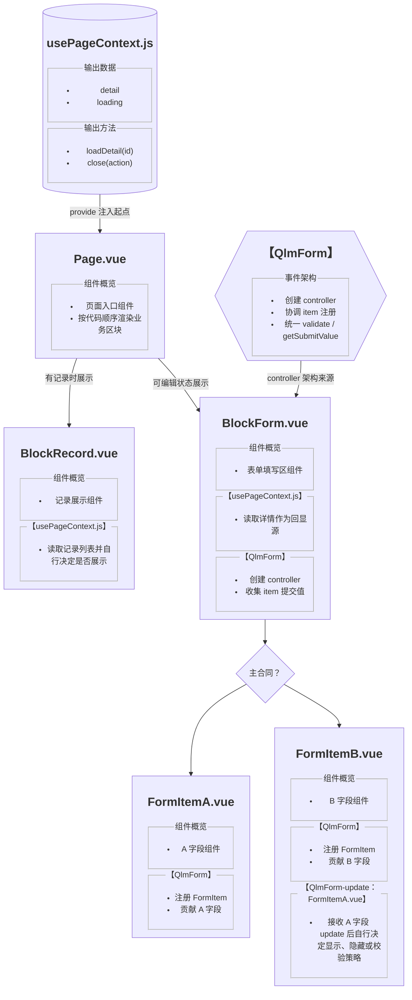

# Vue 架构设计图画法

## 定位

这类图用于描述复杂 Vue 页面、弹框、抽屉、Tab 或区块的开发前架构关系。

它不是源码细节图，也不是 UI 结构图。核心目标是让开发前先把这些事情说清楚：

- 代码文件之间怎么嵌套和挂载
- 组件与组件之间怎么协作
- 数据从哪里注入，哪些组件读取
- 事件从哪里触发，往哪里回传
- 哪些条件会决定同层子组件分组、展示或切换
- 哪些跨组件架构从哪里引入，例如表单 controller、搜索 controller

字段内部用输入框、日期选择器还是上传组件，不放进架构图。那是组件自己的内部实现，直接看组件源码更清楚。

图里不要把所有上下文都写满。描述越多，越容易在节点、连线和判断块之间互相重复甚至冲突。没有确认或没必要说明的地方可以留白；架构图优先表达稳定的文件层级、组件嵌套和少量关键分组逻辑。

## 使用阶段

复杂前端 case 在 Design phase 可以先把图放到 case 目录：

```text
_adoc/case/{case}/02-design/{module}-component-architecture-draft.mmd
```

这时它是讨论稿，用来和用户确认业务状态、数据所有权、架构流转和组件划分。

当图在设计讨论中稳定后，应在 Case Execute 或 case 的第一个实现 work package 里，先创建对应业务目录文件，并把这张图和必要 README 一起落到开发目录：

```text
src/views/xxx/README-component-architecture.mmd
```

这一步发生在具体开发前，而不是代码写完后。图先稳定并落位，后续实现以代码就近目录里的图作为事实源推进。

`README.md` 或 `readme.md` 里只保留入口链接，不把大段 Mermaid 源码直接塞进 README。

## 设计顺序

纯前端实现型 case 进入架构设计时，默认按入口到末端的单向流梳理，不先从零散组件或字段细节开始。

推荐顺序：

1. 确认入口黑箱：`index.vue`、页面根组件、复杂弹框根组件、抽屉根组件或当前 Tab / Step 根组件。
2. 确认 `useXxx.js` / provider / controller：它在哪个组件里创建或引入，输出哪些稳定数据和方法，哪些能力通过 provide / inject 下发。
3. 确认首次渲染链路：入口加载后先取什么数据，根组件按什么状态渲染哪些子组件，子组件从 provider / props / controller 读取什么原始数据。
4. 确认组件协作关系：哪些组件只是父子挂载，哪些组件通过 QlmForm / QlmSearch / provider update 这类 controller 发生协作。
5. 最后确认用户动作链路：修改字段、局部提交、整体提交、步骤切换、关闭刷新等事件。动作链路不要反过来污染组件嵌套关系。

如果渲染链和提交链都复杂，优先先画渲染结构图，再补事件流模块或第二张图。不要为了“一张图讲完全部”把加载、渲染、编辑、提交、切换和刷新线混在一起。

## 入口和 useXxx 写法

`index.vue` / 根组件节点要承担“页面或弹框入口”的说明，而不是只写一个空的组件名。节点里至少说明：

- 它是页面入口、弹框入口、抽屉入口还是某个业务区块入口。
- 它负责创建或调用哪些 `useXxx.js` / provider / controller。
- 它按哪些关键状态决定渲染哪些直接子组件。

`useXxx.js` 这类 hook / provider 节点要优先写输出，而不是写内部实现步骤：

- `输出数据`：页面状态、详情、列表、loading、当前步骤、提交态等。
- `输出方法`：加载、刷新、关闭、提交、切换、注册 controller 等。
- `接口调用`：只写稳定接口意图，不在架构图里展开完整参数细节。

设计阶段可以用业务语言描述尚未落地的变量，例如“当前步骤”“详情数据”“保存弹框”；代码落地后，再用真实文件名、真实变量名或 README 补正。不要在还没实现前提前发明一批看似确定的代码变量。

## 节点内容写法

节点内部使用 HTML 标签，让模块层次清楚。下面所有图形示例都应该按这套节点写法表达，避免前后示例口径不一致。

所有 Vue 组件节点的第一个模块必须是 `组件概览`，先说明这个组件是干什么的。这样用户和 AI 先看懂组件职责，再看数据、事件和 controller 细节。

节点描述只写稳定、必要、可反向定位源码的信息。不要把同一个判断同时写在父节点、菱形、连线和子节点里。没确认的细节宁可不写，避免图上看似完整但逻辑交叉。

推荐格式：



约定：

- `<h2>`：组件名或节点主标题
- `<fieldset>`：一个模块块
- `<legend>`：模块名
- `<ul><li>`：模块内做的事情

常见模块名：

- `组件概览`
- `弹框入口`
- `输出数据`
- `输出方法`
- `接口调用`
- `【useXxx.js】`
- `【QlmForm】`
- `【QlmForm-update：FormItemXxx.vue】`
- `【QlmSearch】`

模块名尽量使用对应文件名或架构名。

如果模块来自 hook / provider 文件，`legend` 直接写文件名，保留 `.js` 后缀。
如果模块来自跨组件 controller 架构，`legend` 写架构名，不加文件后缀。

推荐：

- `【useConstruct.js】`
- `【useCreateStep.js】`
- `【useNumberDeliveryRecord.js】`
- `【QlmForm】`
- `【QlmSearch】`

避免：

- `【contract context】`
- `【form context】`
- `【page data】`
- `【全局状态】`

原因是图要能反向定位源码。看到 `【useConstruct.js】` 时，开发者可以直接去找这个文件；看到 `【QlmForm】` 时，开发者知道这是一个表单 controller 架构，而不是某个本地 hook 文件。

## 图形语义

默认使用 Mermaid `flowchart`。



### 方块：Vue 组件文件

方块只表示 `.vue` 文件。一个 Vue 文件必然是一个 Vue 组件；它是不是“业务组件”不需要在图形语义里判断。

适合：

- `index.vue`
- `BlockForm.vue`
- `BlockView.vue`
- `FormItemDataNum.vue`
- `BlockHeader.vue`
- `DialogContent.vue`

不适合：

- 接口调用
- 状态判断
- composable hook
- controller 架构

组件图的主结构优先表达代码文件嵌套关系。跨组件通知、事件监听、update 联动不要画成父子层级；如果组件实际在代码里是平级挂载，就在图里保持平级，再把联动写进接收方组件节点内部。

方块和方块之间的线可以写简单、稳定的挂载或显隐逻辑，例如：



没有菱形时，线上的短文案可以承担简单条件说明；已有菱形分组时，线上的文案要更少，避免重复。

### 菱形：需要分组的逻辑判断

菱形不是接口分支图形，也不是所有 `v-if` 的默认图形。它只用于“同一父组件下有多组子组件，并且这些子组件需要按判断条件分组展示”的场景。

菱形不会改变组件层级。它只是插在父组件和一组子组件之间，帮助读者理解这一组子组件为什么归在一起。

推荐：



避免：

- 菱形连菱形
- 为简单条件单独画一个菱形
- 用菱形表达接口分支
- 用菱形表达普通提交流程
- 在菱形里写完“主合同”，线上又重复写“主合同展示”

简单显隐条件优先写在线上，例如 `服务时间异常时展示`。只有当一组同层子组件需要被整体分组时，才加菱形。

菱形里的文字要短，只写最核心的分组条件，例如 `主合同？`、`子合同？`。菱形后的线通常不写文案；如果必须写，也只写极短分支词。不要写“有”“是”这类没有信息量的线文案。

### 圆柱：数据源 / provider hook

圆柱用于表示以数据为核心、附带基础方法的 hook 或 provider。



规则：

- 圆柱只连到注册 / provide 它的组件。
- 其他 inject 它的组件不要继续画线，否则图会乱。
- 其他组件在自己的方块内部用模块说明自己从这个 hook 里拿了什么。

### 六边形：controller / 事件架构

六边形用于表示不以存值为核心，而是协调跨组件事件、注册、校验、取值或搜索触发的 controller 架构。

适合：

- `QlmForm`
- `QlmSearch`
- 后续类似的表单、搜索、表格上层 controller

示例：



规则：

- controller 架构块只连到引入它的组件。
- 子组件不必都连回 controller；在子组件方块内部写 `【QlmForm】` 模块即可。
- 这样能表达“从引入组件往下都带上 QlmForm 模块”，但不把图画成满屏交叉线。

## QlmForm 模块写法

如果组件本身是一个 FormItem，节点里写 `【QlmForm】` 模块，说明它如何注册、校验、贡献字段。

```html
<fieldset>
  <legend>【QlmForm】</legend>
  <ul>
    <li>注册 FormItem</li>
    <li>贡献提前开通原因字段</li>
    <li>显示状态下参与必填校验</li>
  </ul>
</fieldset>
```

如果组件还会接收另一个 FormItem 的 update 事件，不要把这条关系画成组件层级线；在接收方节点里增加独立模块：

```html
<fieldset>
  <legend>【QlmForm-update：FormItemServiceTime.vue】</legend>
  <ul>
    <li>事件来源：服务时间 FormItem 的时间判断结果</li>
    <li>主合同且开始时间早于签约时间时，本组件显示并开启必填校验</li>
    <li>主合同且开始时间不早于签约时间时，本组件隐藏并跳过必填校验</li>
    <li>子合同场景下，本组件隐藏并跳过必填校验</li>
  </ul>
</fieldset>
```

拆成两个模块的原因：

- `【QlmForm】` 说明“我自己作为 FormItem 做什么”。
- `【QlmForm-update：来源组件】` 说明“我接收谁的 update 后做什么”。

这能同时表达组件自身职责和跨组件事件关系，不污染代码嵌套层级。

设计阶段不要提前发明未来代码变量名。比如还没写代码时，不要直接写 `isBeforeContractTime`；应该写“服务时间 FormItem 的主合同时间判断结果”。等代码落地后，再按真实变量名更新图。

## 数据与事件的表达

### 数据源只画注入起点

`useXxx.js` 这类 provider hook 用圆柱表示。

它往 `index.vue` 或对应 provider 组件画一条线，表示注入起点。

字段组件、查看组件、日志组件如果读取它，不额外连线，只在方块内部说明：

```html
<fieldset>
  <legend>【useNumberDeliveryRecord.js】</legend>
  <ul>
    <li>读取 pro_recordForm.dataNum 作为默认值</li>
  </ul>
</fieldset>
```

### 事件架构只画来源

`QlmForm` 这类 controller 用六边形表示。

它只连到引入 controller 的组件，例如 `BlockForm.vue`。

子 `FormItem*` 方块里说明自己：

```html
<fieldset>
  <legend>【QlmForm】</legend>
  <ul>
    <li>注册 FormItem</li>
    <li>返回字段片段</li>
  </ul>
</fieldset>
```

### 只画当前范围内的事件

事件箭头只画会影响当前图范围内组件联动的事件。

如果当前图是 `Step1`，可以画：

- 父入口如何进入 `Step1`
- `Step1` 如何渲染字段组件
- 字段组件如何把跨字段事件回传给 `Step1`
- `Step1` 内部如何进入提交动作

不要画：

- `Step1` 保存成功后外层 `create/index.vue` 怎么切到 `Step2`
- 外层页面如何处理后续步骤
- 当前范围之外的刷新、跳转和缓存细节

这些属于上层流程图或完整 create 页面图。局部图只保留必要入口，不把结果线再拉回外层页面，避免一张局部图变成全页面流程图。

## 节点命名

Mermaid 源码里的节点名要尽量接近源码文件名，方便从图回到代码。

推荐使用可读前缀：

- `.vue` 文件节点：`vue_组件名`，例如 `vue_BlockForm`
- `.js` 文件节点：`js_文件名`，例如 `js_usePageContext`
- 判断节点：`judge_判断名`，例如 `judge_isMainContract`
- controller 节点：`controller_架构名`，例如 `controller_QlmForm`

推荐：



避免：



判断节点可以带所属组件前缀，例如：

- `judge_indexViewMode`
- `judge_blockFormMainContract`
- `judge_blockFormSubContract`

## 粒度控制

这类 Vue 架构图的核心依据是文件。它主要回答：

- 要创建或维护哪些 `.vue` / `.js` 文件
- Vue 组件文件之间是什么嵌套和挂载关系
- provider hook、controller 这类非 Vue 文件在哪个组件文件里引入
- 少量分组条件如何影响同层 Vue 子组件的组织

图上的业务逻辑只保留到能解释文件关系为止。也就是说，读图后应该能看出实现时要落哪些文件、这些文件谁挂谁、哪些文件引入了额外框架；不追求把完整业务流程画出来。

复杂模块文件多时，图变大是可以接受的。画架构图的目的就是把文件关系说明白；文件少、关系简单的模块本来就不一定需要画图。

如果一个页面由多个 Tab / Step / Block 组成，优先以当前要说明的 Tab / Step / Block 为起点画局部文件关系图，而不是默认从整个页面入口画到底。只有当目标是说明完整页面文件组织时，才画完整页面图。

应该写：

- `BlockForm.vue` 下面挂载 `FormItemDataNum.vue`
- `BlockForm.vue` 引入 `QlmForm` controller
- `FormItemDataNum.vue` 作为 FormItem 注册并贡献字段片段
- `FormItemAdvanceReason.vue` 接收 `FormItemServiceTime.vue` 的 QlmForm update 后自行决定显示和校验

不应该写：

- 完整接口参数拼装细节
- 完整提交流程和所有异常分支
- 交付时间用的是 `el-date-picker`
- 上传按钮隐藏规则
- textarea 限制 50 字
- 某个 class 的宽度和间距

这些属于组件内部实现，留在组件源码或局部 README 里即可。

## 推荐模板



## 判断清单

画图前先过一遍：

- 方块是不是都是真组件？
- 组件图主结构是不是优先表达代码文件嵌套？
- 每个 Vue 组件节点的第一个模块是不是 `组件概览`？
- `组件概览` 第一条有没有说清这个组件是干什么的？
- 菱形是不是只用于同层子组件分组判断？
- 简单条件是不是写在线上，而不是单独画菱形？
- `useXxx.js` 是否用圆柱，并且只连到 provide 起点？
- `QlmForm / QlmSearch` 是否用六边形，并且只连到引入 controller 的组件？
- FormItem 自身注册逻辑是否写在 `【QlmForm】` 模块？
- 接收其他 FormItem update 的逻辑是否单独写在 `【QlmForm-update：来源组件】` 模块？
- 跨组件 update 有没有避免画成错误的父子层级？
- 图里有没有提前发明未来实现变量名？
- 图里有没有塞进本该留给组件源码的 UI 细节？
- 图里有没有把未确认或不必要的描述写满，导致节点、连线和判断块互相重复？
- Mermaid 节点名是否接近源码文件名？
