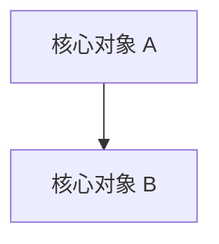
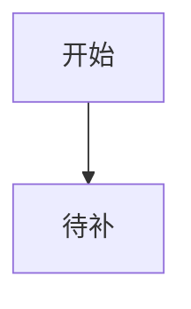

# AIPD2 Update

`aipd2-update` 用于把一个已经初始化过 AIPD 的项目，升级到当前 AIPD2 的最新项目入口、项目记忆地图和 case 观察锚点规则。

它不是初始化入口，也不是经验回流入口：

- 初始化新项目用 `aipd2`。
- 从会话和 transcript 提炼框架经验用 `aipd2-learn`。
- 已有项目同步 AIPD2 新结构、新模板、新 map 规则，用 `aipd2-update`。

## 职责边界

**只做**：审计当前项目 AIPD 架构 → 对比当前 AIPD2 模板和规则 → 输出更新清单 → 用户确认后安全合并更新。

**不做**：不改业务代码，不执行 case step，不归档 case，不自动提交，不覆盖用户项目文档正文。

## 更新对象

优先检查：

- `AGENTS.md`：AIPD 项目入口区块是否包含最新记忆读取、L3/L5 边界和恢复链路。
- `_adoc/index.md`：是否声明 `_adoc/map.md`、L3 核心概念、L4 功能线、L5 工程实现层和读取原则。
- `_adoc/map.md`：是否存在，是否包含高频任务入口、L3 核心概念总表、L4 产品功能线总表、L5 工程规则总表、自迭代观察锚点。
- `_adoc/context-map.md`：旧项目兼容入口；存在时检查是否需要迁移或合并到 `_adoc/map.md`，不默认删除。
- `_adoc/L3-core/map.md`：是否具备核心概念图骨架；不存在时只列建议，不默认凭空生成业务概念。
- `_adoc/L4-product/map.md`：是否具备产品功能线总图；不存在时只列建议。
- `_adoc/L4-product/{feature}/map.md`：如果用户明确指定功能线，检查是否需要创建该功能线 map。
- `_adoc/L5-dev/index.md`：是否表达“工程实现层”边界，而不是把 L5 当代码细节全集。
- `_adoc/case/**/case.md`：进行中 case 是否有上下文索引和自迭代观察锚点。

按需检查：

- `CLAUDE.md`：如果项目使用 Claude Code 或已有该文件，检查其中 AIPD 区块。
- 局部 `README.md`：只检查是否存在与本次更新相关的入口，不批量改页面/组件 README。

## 第一步：判断项目状态

先读取：

```bash
pwd
git status --short
test -f AGENTS.md && sed -n '1,260p' AGENTS.md
test -f _adoc/index.md && sed -n '1,220p' _adoc/index.md
test -f _adoc/map.md && sed -n '1,260p' _adoc/map.md
find _adoc -maxdepth 3 -type f | sort
```

如果没有 `_adoc/`，停止并建议使用 `aipd2` 初始化，不要把 update 当初始化用。

如果工作区有未提交改动，继续审计可以进行，但在输出中标记风险；执行写入前提醒用户当前工作区已有改动。

## 第二步：审计差异

对照当前 AIPD2 注入模板和规则审计，不要求逐字一致，重点看能力是否存在。

### 必须项

- `AGENTS.md` 有 AIPD 标记区块，或有明确 AIPD 项目入口。
- 入口链路包含 `_adoc/index.md`。
- 入口链路包含 `_adoc/map.md`，或旧项目明确兼容 `_adoc/context-map.md` 并说明缺失时的兜底检索策略。
- L3 被定义为核心对象、领域语言、核心流程、数据模型和系统成立方式。
- L4 被定义为产品功能线、业务边界、交互规则和实现入口地图的承载层。
- L5 被定义为产品功能到代码实现之间的工程实现层，负责跨模块、跨端、跨页面的稳定实现规则。
- 明确页面、弹窗、组件内部细节放就近 `README.md`，不塞回 L5。
- case 恢复链路包含 case / step 文件作为事实源。

### 建议项

- `_adoc/map.md` 包含高频任务入口、L3 核心概念总表、L4 产品功能线总表、L5 工程规则总表、自迭代观察锚点。
- `_adoc/L3-core/map.md` 有核心概念图骨架。
- `_adoc/L4-product/map.md` 有产品功能线总图骨架。
- 用户明确指定的 L4 功能线有 `_adoc/L4-product/{feature}/map.md`，并能记录页面、接口、数据对象、权限码、相关 L3/L5。
- `_adoc/L5-dev/index.md` 有跨模块工程规则索引。
- 进行中 case 有“层级判断、必读文档、代码入口、兜底搜索、风险边界、自迭代观察锚点”。

### 不自动改项

- 不凭空生成业务核心概念、产品功能清单或页面 README。
- 不重写用户已有 `_adoc` 正文。
- 不迁移历史 case，不批量补所有旧 case，除非用户明确要求。

## Map 骨架

当用户明确要求补 L3 / L4 map，或审计清单确认后需要创建空骨架，使用下面的最小结构。骨架只提供 AI 检索入口，不替用户编造业务事实。

### L3 核心概念 map

文件建议：`_adoc/L3-core/map.md`

````md
# L3 核心概念地图

## 核心概念总表

| 用户说法 / 黑话 | 标准概念 | 含义 | 细节文档 | 相关 L4 功能线 | 常见误解 |
|---|---|---|---|---|---|
| {待补} | {待补} | {待补} | {待补} | {待补} | {待补} |

## 对象关系



## 兜底搜索

- `rg "{核心词|别名}" .`
````

### L4 产品功能线总 map

文件建议：`_adoc/L4-product/map.md`

````md
# L4 产品功能线地图

## 功能线总表

| 用户说法 / 场景 | 标准功能线 | 功能线 map | 前端入口 | 后端入口 | 数据对象 | 相关 L3 | 相关 L5 |
|---|---|---|---|---|---|---|---|
| {待补} | {待补} | `_adoc/L4-product/{feature}/map.md` | {待补} | {待补} | {待补} | {待补} | {待补} |

## 兜底搜索

- `rg "{功能线关键词|页面名|接口名}" .`
````

### L4 单功能线 map

文件建议：`_adoc/L4-product/{feature}/map.md`

````md
# {功能线名} Map

## 功能线边界

- 要解决的问题：{待补}
- 包含场景：{待补}
- 不包含场景：{待补}

## 实现入口

| 场景 | 前端入口 | 后端入口 | 数据对象 | 权限码 | 说明 |
|---|---|---|---|---|---|
| {待补} | {待补} | {待补} | {待补} | {待补} | {待补} |

## 相关认知

- L3：{核心概念 map}
- L5：{工程规则 map}
- 局部 README：{页面 / 弹窗 / 组件 README}

## 流程图



## 兜底搜索

- `rg "{功能线关键词|接口名|权限码}" .`
````

## 第三步：输出更新清单

默认只输出清单，不写文件。

```md
【AIPD2 Update 审计结果】

项目：
- 路径：{project_root}
- 分支：{branch}
- 工作区：{clean / dirty}

总体判断：
- 当前 AIPD 状态：已初始化 / 部分初始化 / 不是 AIPD 项目
- 建议动作：无需更新 / 建议补齐 / 需要迁移

需要更新：
- `AGENTS.md`：{缺什么；为什么要改；计划怎么合并}
- `_adoc/index.md`：{缺什么；为什么要改；计划怎么合并}
- `_adoc/map.md`：{不存在 / 缺章节 / 需要补路由 / 是否需要从 context-map 迁移}

建议更新：
- `_adoc/L3-core/map.md`：{建议补核心概念图骨架；如果用户指定概念，可先列候选，不擅自定稿}
- `_adoc/L4-product/map.md`：{建议补功能线总图骨架}
- `_adoc/L4-product/{feature}/map.md`：{用户指定功能线时，建议创建功能线图，记录页面 / 接口 / 数据对象 / 权限 / L3 / L5}
- `_adoc/L5-dev/index.md`：{建议补工程实现层边界}
- `{case}`：{建议补观察锚点}

不处理：
- {明确不碰哪些业务文档、代码、历史 case}

待用户确认：
- 是否执行上述更新？
```

## 第四步：用户确认后写入

只有用户明确确认后才修改文件。

写入规则：

1. `AGENTS.md`
   - 如果有 `<!-- AIPD:START -->` 和 `<!-- AIPD:END -->`，只替换标记区块。
   - 如果没有标记但有 AIPD 内容，先说明风险，优先追加新标记区块，不删除原文。
   - 如果不存在，写入当前 `@references/agent-entry/template.md` 并包裹 AIPD 标记。

2. `_adoc/index.md`
   - 已存在时只补缺失章节或关键规则，不覆盖项目状态、OKR、case 等项目事实。
   - 不存在时使用 `@references/adoc/templates/index.md` 创建。

3. `_adoc/map.md`
   - 不存在时使用 `@references/adoc/templates/map.md` 创建。
   - 已存在时只补缺失的标准章节，不删除用户已有路由。
   - 如果只存在 `_adoc/context-map.md`，优先建议创建 `_adoc/map.md` 并迁移/引用其中稳定入口；不默认删除 `_adoc/context-map.md`。

4. `_adoc/L3-core/map.md` / `_adoc/L4-product/map.md` / `_adoc/L5-dev/map.md`
   - 不凭空生成业务内容。
   - 可以补一个空骨架或边界说明，但必须先在更新清单中列明，等用户确认。

5. `_adoc/L4-product/{feature}/map.md`
   - 只有用户明确指定功能线或审计发现已有功能线目录时才建议创建。
   - 功能线 map 可以记录稳定入口：前端页面、后端接口、数据对象、权限码、相关 L3 概念、相关 L5 工程规则、局部 README。
   - 不写页面内部实现细节；细节继续放代码目录 README。

6. 进行中 case
   - 默认不批量修改历史 case。
   - 只在用户确认时，为当前进行中 case 补上下文索引缺口或自迭代观察锚点。

## 第五步：完成后说明

返回：

- 修改了哪些文件。
- 哪些建议没有执行，为什么。
- 是否需要重新运行 `aipd2-case-create` 或 `aipd2-learn`。
- 是否建议提交当前改动。

不要自动提交。
